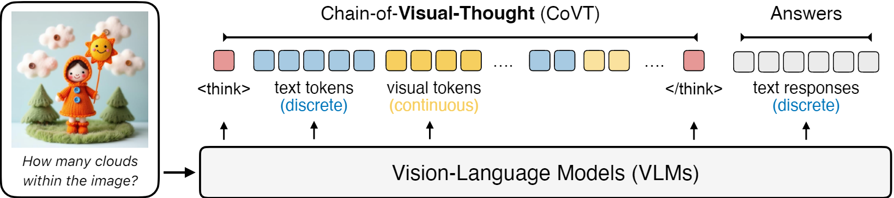
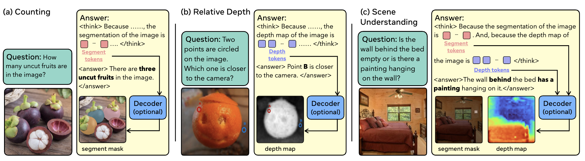
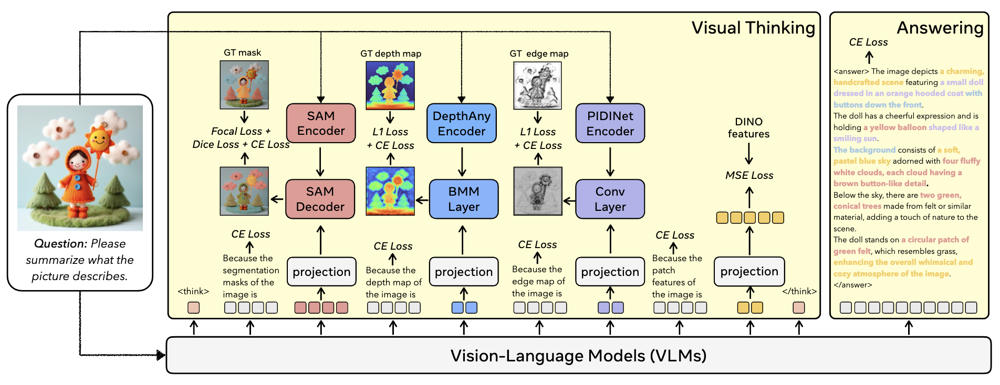

# Applying CoVT to Korean Cultural Image Captioning with Knowledge Injection

> Independent experiments by an undergraduate researcher, built on top of [CoVT (Chain-of-Visual-Thought)](https://arxiv.org/abs/2511.19418) by Qin et al. (UC Berkeley, 2025).

---

## Overview


*Figure: CoVT overview. Source — [Qin et al., "Chain-of-Visual-Thought" (arXiv:2511.19418)](https://arxiv.org/abs/2511.19418)*

This repository documents two sets of experiments applying [CoVT](https://arxiv.org/abs/2511.19418) to caption generation for fine-tuning a Korean-domain MLLM. The dataset comprises two main categories:

- **Senior Interest Domain**: general-interest imagery (activities, daily life, etc.) relevant to senior users
- **Korean Cultural Heritage Domain**: Korean cultural imagery characterized by sparse training coverage and high sensitivity to cultural hallucination

The experiments proceed in two stages:

1. **Experiment 1** *(small-scale MVP)*: Validate CoVT's captioning performance across the full dataset — including a curated subset with high hallucination risk. This established that CoVT produces reliable captions for the senior interest category directories, which were subsequently captioned with CoVT.
2. **Experiment 2**: For the Korean cultural heritage domain — where hallucination risk is higher and visual grounding alone is insufficient — design and evaluate a knowledge injection framework and a per-image model selection strategy.

*Note: The dataset was collected and used during a research internship. Raw data is not publicly available.*

The final output is a curated training dataset of **24,923 images** with model-selected captions, intended for fine-tuning a Korean-domain MLLM.

---

## Research Motivation

### Problem: Three Failure Modes in VLMs for Domain-Specific Captioning

Applying general-purpose VLMs to Korean cultural imagery surfaces three distinct failure modes:

| Failure Mode | Description | Example |
|---|---|---|
| **Object Hallucination** | Generating entities absent from the image | Labeling a Korean kite-flying scene as "Chinese Dragon Boat Festival" |
| **Language Prior Dominance** | Captions driven by pre-trained text patterns rather than visual evidence | Describing any traditional gathering as "symbolizing unity and harmony" |
| **Subjective Injection** | Inserting unverifiable symbolic or emotional content | "The ritual carries deep ancestral meaning" (image shows men in suits) |

These issues are amplified in underrepresented domains where pre-trained models lack localized knowledge.

### Why CoVT? And Why Is It Insufficient Alone?

CoVT introduces continuous visual tokens (segmentation, depth, DINO, edge) into VLM reasoning chains, improving perceptual grounding on general benchmarks. This raised a natural question: does better visual grounding reduce cultural hallucination?

**Short answer: partially, but not sufficiently.**

- CoVT reduces hallucination driven by visual ambiguity
- CoVT *cannot* supply missing semantic knowledge — it cannot identify an unfamiliar cultural artifact by name, even when it describes its shape correctly
- This gap motivated designing a knowledge injection mechanism that complements CoVT's perceptual strengths

---

## Method


*Figure: CoVT training pipeline. Source — [Qin et al., "Chain-of-Visual-Thought" (arXiv:2511.19418)](https://arxiv.org/abs/2511.19418)*


*Figure: CoVT method overview. Source — [Qin et al., "Chain-of-Visual-Thought" (arXiv:2511.19418)](https://arxiv.org/abs/2511.19418)*

### Experiment 1 — Baseline Validation

**Setup**: Controlled comparison between Qwen2.5-VL-7B (baseline) and CoVT-7B-seg_depth_dino across three evaluation tracks — **Track A** (General, n=50), **Track B** (Korean, n=40), **Track C** (Stress, n=5). GPT-4.1-mini served as blind judge using five criteria (grounding, neutrality, generalization, hallucination absence, detail) with random answer-order swapping to eliminate position bias.

**Progressive prompt design (P0–P3)**:

| Prompt | Strategy |
|---|---|
| P0 | Baseline: describe overall scene structure and main objects in one clear sentence |
| P1 | Explicit spatial/depth reasoning: describe precise front-to-back object relationships using internal visual reasoning |
| P2 | Extend P1 with DINO feature reference: verify scene structure using perception DINO features |
| P3 | Training-format-aligned: use segmentation, depth map, and perception features to verify scene structure |

**Table 2. Comparison of base and CoVT by prompt**:

| Track | Prompt | Samples | Base Win Rate | CoVT Win Rate | Ties |
|---|---|---|---|---|---|
| A (General) | P0 | 50 | 0.54 | 0.46 | 0 |
| A (General) | P1 | 50 | 0.72 | 0.28 | 0 |
| A (General) | P2 | 50 | 0.52 | 0.48 | 0 |
| **A (General)** | **P3** | **50** | **0.40** | **0.60** | **2** |
| B (Korean) | P0 | 40 | 0.50 | 0.50 | 0 |
| B (Korean) | P1 | 40 | 0.625 | 0.375 | 0 |
| B (Korean) | P2 | 40 | 0.55 | 0.45 | 0 |
| **B (Korean)** | **P3** | **40** | **0.4375** | **0.5625** | **1** |
| C (Stress) | P0 | 5 | 0.80 | 0.20 | 0 |
| C (Stress) | P1 | 5 | 0.80 | 0.20 | 0 |
| C (Stress) | P2 | 5 | 1.00 | 0.00 | 0 |
| **C (Stress)** | **P3** | **5** | **0.20** | **0.80** | **0** |

**Key findings**:

1. **Prompt Sensitivity**: Overly specific instructions degraded CoVT performance significantly — P1 (explicit spatial/depth reasoning) drove baseline win-rate up to **0.72** across Track A, suggesting that task-directive prompts suppress CoVT's latent visual reasoning pathway rather than activating it.

2. **Effective Prompt Strategy (P3)**: Prompts aligned with CoVT's training-time format (segmentation / depth map / perception features) consistently outperformed the baseline across all three tracks — CoVT win-rate: **0.60** (General) / **0.5625** (Korean) / **0.80** (Stress).

3. **CoVT Performance Validation (vs. original captions)**:

**Table 3. Comparison between original dataset captions and CoVT captions (P3)**:

| Track | Samples | Original Win Rate | CoVT Win Rate |
|---|---|---|---|
| A (General) | 50 | 0.04 | **0.96** |
| B (Korean) | 45 | 0.00 | **1.00** |
| C (Stress) | 5 | 0.40 | **0.60** |

Properly activated CoVT (P3) substantially outperforms original dataset captions across all tracks (win-rate up to 0.96–1.0), validating CoVT as a reliable captioning backbone for fine-tuning data construction.

> **Contribution**: Highlights the importance of aligning prompt design with model-internal reasoning mechanisms — prompt format, not prompt content specificity, is the key driver of robust multimodal generation with CoVT.

### Experiment 2A — Extending to Cultural Context (without KB)

Extended prompt space to P0–P6 on 50 Korean cultural images, adding culturally framed instructions to probe whether CoVT's visual grounding could generalize to domain-specific captioning without external knowledge.

**Table 1. Comparison of base and CoVT under prompts** (GPT-4.1-mini judge):

| Prompt | Samples | Base Win Rate | CoVT Win Rate | Ties |
|---|---|---|---|---|
| P0 | 50 | 0.69 | 0.31 | 7 |
| P1 | 50 | 0.70 | 0.30 | 0 |
| P2 | 50 | 0.62 | 0.38 | 4 |
| P3 | 50 | 0.56 | 0.44 | 0 |
| P4 | 50 | 0.51 | 0.49 | 3 |
| P5 | 50 | 0.50 | 0.50 | 6 |
| **P6** | **50** | **0.40** | **0.60** | **0** |

P6 ("Describe the visual appearance and cultural context of '{category}' in exactly one sentence.") achieved the best CoVT win-rate of **0.60**, showing progressive improvement from P0 to P6 as prompts shifted toward visual-first, culturally grounded description.

Analysis of 30 CoVT-winning captions:

| Pattern | Frequency |
|---|---|
| Suppression of baseline hallucinations | 93.3% |
| More visually grounded details | 60.0% |
| Correct use of cultural terminology within visual bounds | 50.0% |

Despite these wins, qualitative analysis confirmed persistent **cultural hallucination** in both models — unverifiable claims generated from textual priors rather than image content. This motivated external knowledge injection.

| | **Example 1** — 성묘 (Grave Visitation) | **Example 2** — 윷놀이 (Yutnori) |
|---|---|---|
| **Base** | "Seongmyo, a significant historical site in South Korea, is a **royal ancestral shrine where kings and their families are honored**, reflecting the country's **rich Confucian heritage and respect for lineage and tradition**." | "The image depicts two children dressed in traditional Korean hanbok, engaging in the playful activity of juggling wooden sticks, which is **a common element in the cultural game known as Yutnori**." |
| **CoVT** | "Seongmyo, a significant historical site in South Korea, serves as **a place of reverence for the veneration of ancestors and the preservation of cultural heritage**." | "The image depicts two children dressed in traditional Korean hanbok, engaging in the playful activity of juggling wooden sticks, which is **a form of Yutnori, a traditional Korean game that combines elements of juggling and board games**." |
| **Hallucination** | "royal ancestral shrine," "Confucian heritage" — without domain knowledge of 성묘, the category label alone is uninterpretable; the model fills the gap with textual priors, failing to ground in the visible scene (suited men standing at a grave) | "Yutnori" misidentified — without knowledge of what 윷 looks like, the model cannot correctly interpret the sticks; game type asserted from prior, not visual evidence |

### Experiment 2B — Knowledge-Injected Captioning

#### Knowledge Base Design

- 32 categories mapped to dictionary-style, **visually grounded definitions** (what is visible in an image, not encyclopedic background)
- Integrated via RAG-style prompting — no fine-tuning required
- Core design principle: treat KB as a **naming guide**, not a content source

**Negative constraint**: prompts explicitly prohibited the model from including KB content not directly visible in the image.

#### Systematic Prompt Exploration (P7–P16)

Three iteration rounds across 10 prompt variants:

| Round | Prompts | Focus |
|---|---|---|
| v2 | P7–P13 | KB presentation format: parenthetical, reference block, naming guide, conditional application |
| v3 | P14–P16 | Combining best v2 elements: image-first + KB isolation, visual detail density, double grounding |
| Final | P15 | Large-scale validation on 640 images (20 per category) |

**Final prompt (P15)**:
```
Reference: {category} — {definition}.
Describe what you actually see in this image in exactly one sentence,
noting colors, shapes, and spatial arrangement.
Use the correct Korean cultural term if visually supported.
Do not include any reference details that are not visible.
```

P15 was selected after identifying a key failure in earlier prompts: CoVT captions were 9–19 characters shorter than baseline captions, with reduced visual detail. P15's explicit instructions ("colors, shapes, and spatial arrangement") addressed this gap while preserving grounding constraints.

---

## Key Results and Analysis

### Large-Scale Evaluation (640 images, P15)

Domain-level breakdown revealed that CoVT's advantage varies systematically across categories:

| Domain | CoVT Win Rate | Reason |
|---|---|---|
| History | **0.359** | Monuments, statues, archival photos — minimal perceptual signal from visual tokens |
| Architecture | 0.483 | Single-subject buildings — limited spatial variation |
| Folk | 0.473 | Costume/movement interpretation requires cultural semantics, not spatial perception |

### Domain-Level Performance Variation

**1. Domain mismatch**: CoVT's visual tokens (Seg/Depth/DINO/Edge) are optimized for spatial tasks (counting, depth ordering). In knowledge-intensive categories, they add no marginal value over the baseline.

**2. Fine-tuning distribution shift**: CoVT was fine-tuned on vision-centric data (LLaVA-OneVision, TallyQA, ADE20K-Depth) with no Korean cultural imagery, partially diluting Qwen2.5-VL's pre-trained cultural knowledge in knowledge-intensive domains.

**3. Caption convergence**: For visually homogeneous categories (e.g., Haenggung palace images), CoVT produced near-identical captions with >0.9 SequenceMatcher similarity across 62 image pairs. When visual tokens fail to encode domain-specific distinctions, the `<think>...<visual tokens>...</think>` reasoning chain becomes a passthrough, and generation collapses toward the fine-tuning distribution mean.

### Winner-Model Selection with Deduplication (Strategy C)

This domain-level variation motivated a per-image selection strategy rather than committing to either model globally:

1. **Per-image GPT-based selection**: Use GPT-4.1 pairwise evaluation to select the better caption per image (CoVT or baseline). Automatically adapts to domain-level performance variation without manual rules.
2. **SequenceMatcher deduplication**: Remove captions with similarity > 0.85 within each category; retain the more specific caption (by word count).

**Result**: 24,923 training images with quality-selected, deduplicated captions across 32 Korean cultural categories.

---

## Technical Stack

| Component | Technology |
|---|---|
| Base VLM | Qwen2.5-VL-7B-Instruct |
| Visual Reasoning | CoVT (Chain-of-Visual-Thought) — Seg/Depth/DINO tokens |
| Knowledge Integration | Dictionary-style KB with RAG-style prompting (no fine-tuning) |
| Evaluation | GPT-4.1 / GPT-4.1-mini pairwise judging via OpenAI API |
| Deduplication | Python `SequenceMatcher` (threshold: 0.85) |
| Framework | PyTorch, Hugging Face Transformers |

---

## Repository Structure

```
gradio/
├── gen_scripts/      # Caption generation scripts (CoVT + baseline, KB-injected variants)
├── eval_scripts/     # GPT-based pairwise evaluation scripts
└── gradio_demo.py    # Interactive demo
train/                # CoVT training code (forked from original repo)
VLMEvalKit/           # Evaluation framework (forked)
docs/                 # Original CoVT documentation
assets/               # Figures used in this README
```

---

## What This Work Is (and Is Not)

This is an independent undergraduate research project — not a paper submission or formal study. The contribution is primarily:

- Systematic empirical investigation of where and why CoVT's advantage varies across cultural domains
- A structured knowledge injection design that separates visual grounding from semantic naming
- Domain-level performance analysis (domain mismatch, fine-tuning distribution shift, caption convergence) with traceable causes
- A 24,923-image training dataset constructed via winner-model selection and deduplication

The original CoVT framework was developed by Qin et al. (2025) at UC Berkeley. This work is an application and extension study built on their publicly released code and models.

---

## Original CoVT Paper

```bibtex
@article{qin2025chain,
  title={Chain-of-Visual-Thought: Teaching VLMs to See and Think Better with Continuous Visual Tokens},
  author={Qin, Yiming and Wei, Bomin and Ge, Jiaxin and Kallidromitis, Konstantinos and Fu, Stephanie and Darrell, Trevor and Wang, Xudong},
  journal={arXiv preprint arXiv:2511.19418},
  year={2025}
}
```
